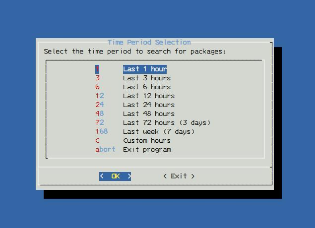

# rePacman

Painless Pacman Reinstaller Tool - A TUI utility for recovering from interrupted Arch Linux system upgrades.



## Install
```bash
git clone https://github.com/scr0lll0ck1s4b0v3h0m3k3y/repacman.git
cd repacman
chmod +x repacman
```

## Usage
```bash
sudo ./repacman
```

## Features
- Sorted by modification time (newest first)
- Detailed file info view
- Reinstallation with --overwrite

## How it works
rePacman leverages the existing package cache on your Arch Linux system to reinstall packages after an interrupted system upgrade. Key functionalities include:

1. Time-based package search in `/var/cache/pacman/pkg/`
2. User-friendly display of found packages
3. Optional detailed file information view
4. Reinstallation using `pacman` with `--overwrite "*"`

It's particularly effective when packages have been downloaded but the upgrade was interrupted during installation, allowing quick recovery without re-downloading packages.

## Requirements
- Arch Linux
- dialog
- sudo/root access

## License
MIT
